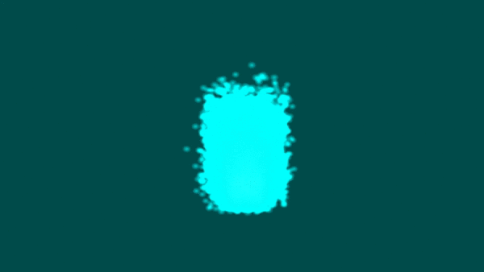

# Simple particle system simulation in C++ using openGL

A simulation of a particle system in openGL that uses 3 different ways of sending particle data down the pipeline and measures  FPS for each one.

It also enables you to move around using W,A,S,D,R,F keys and right mouse button to look around.

Command line program that takes 3 parameters:
*number of particles per second
*maximal allowed number of particles
*flag to select method of drawing (can be 0-Basic, 1-Geometry shader, 2- Instanced shader) 

the end result looks something like that:

### Prerequisites
You need 3 dependancies to get openGL to get the project to work.

--GLAD--
Commandline:
	--profile="core" --api="gl=4.4" --generator="c" --spec="gl" --extensions=""
Online:
	http://glad.dav1d.de/#profile=core&language=c&specification=gl&loader=on&api=gl%3D4.4

--GLM--
version is 0.9.8.5
https://github.com/g-truc/glm/releases/tag/0.9.8.5

--GLFW--
version 3.2.1
https://github.com/glfw/glfw/releases/tag/3.2.1

## License

This project is licensed under the MIT License - see the [LICENSE.md](LICENSE.md) file for details

